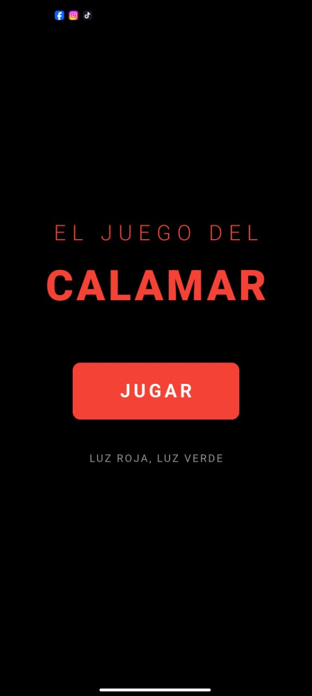
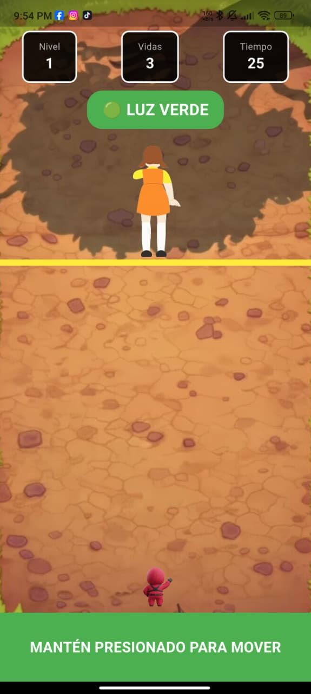
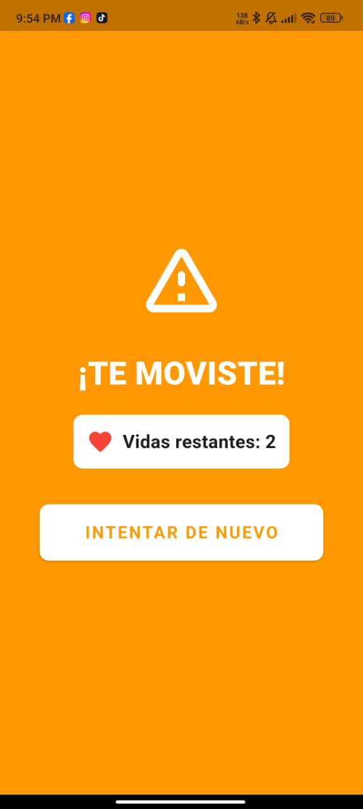

# Juego del Calamar - Luz Roja, Luz Verde

Proyecto Flutter simplificado del juego "Luz Roja, Luz Verde" de El Juego del Calamar.
**Todo el código está en español para facilitar la comprensión.**

## 📸 Capturas de Pantalla

<p align="center">
  
  
  
</p>

## Estructura del Proyecto

```
lib/
├── principal.dart                    # Punto de entrada de la aplicación
├── modelos/
│   └── estado_juego.dart            # Enumeración de estados del juego
├── pantallas/
│   ├── pagina_juego.dart            # Lógica principal del juego
│   ├── pantalla_menu.dart           # Pantalla de inicio
│   ├── pantalla_jugando.dart        # Pantalla de juego
│   ├── pantalla_reintentar.dart     # Pantalla de reintentar
│   └── pantalla_resultado.dart      # Pantalla de victoria/derrota
└── widgets/
    └── caja_informacion.dart        # Widget para mostrar información

assets/
└── images/
    ├── fondo.jpg                    # Fondo del juego
    ├── muneca_frente.png           # Muñeca mirando (luz roja)
    ├── muneca_atras.png            # Muñeca de espaldas (luz verde)
    └── jugador.png                 # Jugador
```

## Descripción de los Archivos

### 1. principal.dart
- Archivo principal que inicia la aplicación
- Crea el MaterialApp y define PaginaJuego como pantalla inicial

### 2. modelos/estado_juego.dart
- Define los 5 estados posibles del juego:
  - `menu`: Pantalla de inicio
  - `jugando`: Jugando
  - `reintentar`: Reintentar después de perder una vida
  - `victoria`: Victoria
  - `derrota`: Derrota

### 3. pantallas/pagina_juego.dart
- Contiene toda la lógica del juego
- Maneja:
  - Variables del juego (nivel, vidas, tiempo, posición)
  - Temporizadores (movimiento, tiempo, muñeca)
  - Funciones de inicio de juego y nivel
  - Movimiento del jugador
  - Lógica de perder/ganar
- Decide qué pantalla mostrar según el estado

### 4. pantallas/pantalla_menu.dart
- Pantalla de inicio
- Muestra el título del juego
- Botón para iniciar el juego

### 5. pantallas/pantalla_jugando.dart
- Pantalla principal donde se juega
- Muestra:
  - Información del juego (nivel, vidas, tiempo)
  - Indicador de luz roja/verde
  - Muñeca que cambia de posición
  - Línea de meta
  - Jugador
  - Botón de control para moverse

### 6. pantallas/pantalla_reintentar.dart
- Se muestra al perder una vida
- Muestra vidas restantes
- Botón para reintentar el nivel

### 7. pantallas/pantalla_resultado.dart
- Pantalla reutilizable para victoria y derrota
- Muestra mensaje según el resultado
- Botón para volver al menú
- **Sin AppBar** para evitar el cuadro vacío arriba

### 8. widgets/caja_informacion.dart
- Widget reutilizable
- Muestra información en cajas (nivel, vidas, tiempo)

## Cómo Funciona el Juego

1. **Inicio**: El jugador presiona "JUGAR" en el menú
2. **Nivel**: Comienza el nivel 1 con 3 vidas y 28 segundos
3. **Muñeca**: Cambia aleatoriamente entre mirar (rojo) y no mirar (verde)
4. **Movimiento**: El jugador mantiene presionado para moverse hacia arriba
5. **Reglas**:
   - Solo puede moverse cuando la luz está verde
   - Si se mueve con luz roja, pierde una vida
   - Si se acaba el tiempo, pierde una vida
   - Si llega a la meta, pasa al siguiente nivel
6. **Niveles**: Hay 3 niveles que aumentan en dificultad
7. **Victoria**: Completar los 3 niveles
8. **Derrota**: Perder las 3 vidas

## Requisitos

- Flutter SDK
- Imágenes en la carpeta `assets/images/`:
  - fondo.jpg
  - muneca_frente.png
  - muneca_atras.png
  - jugador.png

## Cómo Ejecutar

1. Tener Flutter instalado
2. Colocar las imágenes en `assets/images/`
3. Ejecutar:
   ```bash
   flutter pub get
   flutter run
   ```
